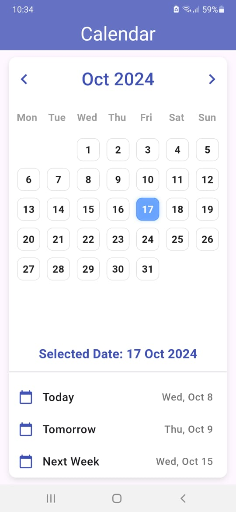

DateCal - Flutter Calendar App

DateCal is a beautifully designed, customizable calendar application built using Flutter. This app allows users to navigate through months, view the days of the current month, and select specific dates with ease. Additionally, it provides convenient shortcuts to view today, tomorrow, and next week's dates.
Features

    * Month Navigation: Easily navigate between months with left and right arrows.
    * Date Selection: Tap on any day in the month to select it and highlight it.
    * Weekday Header: See the names of the days of the week displayed clearly.
    * Shortcut Date Tiles: Quickly view today's date, tomorrow's date, and next week's date.
    * Responsive Design: The calendar grid adjusts according to the available space.
    * Leap Year Support: Properly handles leap years and adjusts February's days accordingly.

## Screenshot

If you like my work and want to show some ❤️, please consider giving a ⭐️ to this Repository.
